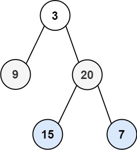

# LeetCode 102: 二叉树的层序遍历

!!! info "题目"
    给你一个二叉树的根节点 `root` ，返回其节点值的 **层序遍历** 。 （即逐层地，从左到右访问所有节点）。

    **示例 1:**
    
    > 输入：root = [3,9,20,null,null,15,7]
    > 输出：[[3],[9,20],[15,7]]

    **示例 2:**
    > 输入：root = [1]
    > 输出：[[1]]

    **示例 3:**
    > 输入：root = []
    > 输出：[]

## 方法一，感觉很差劲 ：

直接就忽略了树这个结构，直接把输入当成一个数组。由于我们有`returnsize`和`returnColumnSizes`这两个变量，所以我们可以遍历来算出节点的个数，然后顺序遍历root数组，每检测到一个非空节点就自增cnt，然后把该节点添加到`result[*returnsize_idx][(*returncolumnsizes)[i++]]`里，并且当`i=**returnColumnSizes`时就令`i=0`，`(*returnsize_idx)++`,一直循环直到`*returnsize_idx==*returnsize&&i==**returnColumnSizes.`显然，这种方法烂到爆炸，完全没有用树这种优秀的数据结构，菜鸟才会这样做

## 方法二，广度优先：

```c
*int** levelOrder(struct TreeNode* root, int* returnSize, int** returnColumnSizes) {

  struct TreeNode** quene =(struct TreeNode** )malloc(sizeof(struct TreeNode*)*2001);
  int** result=(int **)malloc(sizeof(int *)*2001);
  int i=0,j=0;
  int front=0,rear=0;
  struct TreeNode* cur=root;
  quene[rear++]=cur;  //先将根节点入队
  while(i < *returnSize && j < *(returnColumnSizes[i])){
    cur=quene[front++];  //出队
    if(cur!=NULL){
     result[i][j++]=cur->val;
      if(j== *(returnColumnSizes[i])){
        j=0;
        i++;
      }
    }
      quene[rear++]=cur->left;

    quene[rear++]=cur->right;
  }
  return result;
}
```

发现一个问题，`int* returnSize`, `int** returnColumnSizes`这两个变量好像都是未知的，是需要我们返回的，靠！那怎么办？没关系，首先最外层还是一个`while`循环，终止条件变为队列为空，只要队列不为空，我们就出队，如果队首元素不为空，那么`result[i][j++]=cur->val`,那么i什么时候增大，j什么时候清零呢，显然，此时j代表的是最终结果的数组的索引，不能用于判断i是否要增大，因此我们此时可以新维护一个`cnt`变量，用于计算第`i`层已经访问的节点数，并且无论队首元素是否为空，`cnt`都要自增，如果自增后`cnt==2**i`，那么说明该层已经访问完毕，令`i++`,`j=0`;

于是我做出了下面的修改：

```c
int** levelOrder(struct TreeNode* root, int* returnSize, int** returnColumnSizes) {
    struct TreeNode** quene =(struct TreeNode** )malloc(sizeof(struct TreeNode*)*2001);
    int** result=(int **)malloc(sizeof(int *)*2001);
    int i=0,j=0;
    int front=0,rear=0;
    int cnt=0;
    struct TreeNode* cur=root;
    quene[rear++]=cur;  //先将根节点入队
    while(front != rear){
        cur=quene[front++];  //出队
        cnt++;
        if(cur!=NULL){
            result[i]=(int *)malloc(sizeof(int)*2001);
            result[i][j++]=cur->val;
            *(returnColumnSizes[i])+=1;
            if(cnt == pow(2,i)){
                j=0;
                i++;
                cnt=0;
                (*returnSize)++;
            }
        quene[rear++]=cur->left;
        quene[rear++]=cur->right;
        }
        if(cnt == pow(2,i)){
                j=0;
                i++;
                cnt=0;
                (*returnSize)++;
            }
    }
    return result;
```

但是仍然是完全错误的，所以我们决定放弃在这个错误上继续修补，而是新开一种做法，采用层序遍历的标准范式:

```c
int** levelOrder(struct TreeNode* root, int* returnSize, int** returnColumnSizes) {
    if(root==NULL){
        return NULL;
    }
    struct TreeNode* cur=root;
    struct TreeNode** quene=(struct TreeNode**)malloc(sizeof(struct TreeNode*)*2001);
    int front = 0,rear = 0;
    int level=0;
    int ** result=(int **)malloc(sizeof(int *)*2001);
    quene[rear++]=cur;
    while(front!=rear){
        int num=rear-front;//计算该层有多少个节点
        result[level]=(int *)malloc(sizeof(int )*num);
        (*returnColumnSizes)[level]=num; //必须先解引用，再访问！！！<----------------尤其注意！！！！！
        for(int i=0;i<num;i++){
            //把下一层的所有节点全部加入队列
            if(cur->left!=NULL){
            quene[rear++]=cur->left;
            }
             if(cur->right!=NULL){
            quene[rear++]=cur->right;
            }
            //顺便层序输出
            result[level][i]=quene[front++]->val;
            cur=quene[front];
        }
        
        level++;

    }
    *returnSize = level;
    return result;
```

> 上面的代码有一个需要特别注意的地方，就是`(*returnColumnSizes)[level]=num`这个东西必须要这样写，因为要先解引用再访问，并且由于[]的优先级比*高，所以必须要加上括弧才行！

但是依然错掉了，为什么？：

1.我的程序会立刻崩溃。`(*returnColumnCases)[level]=num`;被执行时，程序会当场暴毙。

为什么？因为我从来没有给 `*returnColumnSizes `分配过内存！

从函数参数里收到的 `int** returnColumnSizes` 是一个指向一个` int* `指针的指针。那个` int* `指针本身，在被传进来的时候，是个野指针，它什么都没指向！必须先让它指向一块用`malloc`申请的、实实在在的内存，然后才能往那块内存里写东西！

在`while`循环开始之前，就应该有一行：`*returnColumnSizes = (int*)malloc(sizeof(int) * 2001);`

2.使用cur，会导致最后一次出现问题，从而出现更大的问题

下面直接给出最好的、最标准的写法：

```c
int** levelOrder(struct TreeNode* root, int* returnSize, int** returnColumnSizes) {
    if (root == NULL) {
        *returnSize = 0; // 必须给 returnSize 赋值！
        return NULL;
    }    
    // 动态数组最大尺寸，可以根据题目限制调整
    int MALLOC_SIZE = 2001; 
    // 关键：在循环开始前，为列数数组本身分配内存！
    *returnColumnSizes = (int*)malloc(sizeof(int) * MALLOC_SIZE);    
    int** result = (int**)malloc(sizeof(int*) * MALLOC_SIZE);
    struct TreeNode** queue = (struct TreeNode**)malloc(sizeof(struct TreeNode*) * MALLOC_SIZE);
    int front = 0, rear = 0;
    int level = 0;  
    queue[rear++] = root;
    while (front != rear) {
        int level_size = rear - front;       
        result[level] = (int*)malloc(sizeof(int) * level_size);
        (*returnColumnSizes)[level] = level_size; // 正确的赋值
        // 正确的循环逻辑！
        for (int i = 0; i < level_size; i++) {
            // 1. 每轮只出队一次，存入一个临时变量
            struct TreeNode* node = queue[front++];         
            // 2. 用这个临时变量完成所有事
            result[level][i] = node->val;
            if (node->left) {
                queue[rear++] = node->left;
            }
            if (node->right) {
                queue[rear++] = node->right;
            }
        }
        level++;
    }
    *returnSize = level; // 在最后，报告总层数
    free(queue); // 释放临时队列
    return result;
}
```

**为什么写的更好？**

**核心区别：循环处理逻辑的“精神分裂” vs “井然有序”**

这是我代码能跑和不能跑的**根本原因**。

**灾难现场 :**

```c
// 在for循环开始前，cur是当前层的第一个节点，比如节点A
for(int i=0; i<num; i++){
    // 用节点A的左右孩子去入队
    if(cur->left!=NULL){...} 
    if(cur->right!=NULL){...}

    // 然后又把队头的节点（第一次是A，第二次是B）的值取出来
    result[level][i]=quene[front++]->val; 
    
    // 最后又把cur更新成了队里的下一个节点B
    cur=quene[front];
}
```

**分析这坨屎：** 在`for`循环的**每一次迭代**里，我都用**同一个`cur`**（因为`cur`只在循环的最后才更新，下一轮循环开始时才能用上新的值）去判断`left`和`right`。但你处理`val`和出队的又是`queue[front]`。

- `i=0`时：`cur`是节点A。把A的孩子入队，然后处理A的值。然后`cur`变成了节点B。
- `i=1`时：`cur`是节点B。把B的孩子入队，然后处理B的值。 这看起来好像没什么问题？**问题大了！** 我那个原始代码里，`cur`的更新是在循环里的，但是它的来源在循环外。整个逻辑是拧巴的、丑陋的、极易出错的！最致命的是上次说的崩溃问题，忘了吗？处理完最后一个元素，`quene[front]`就是非法访问！

**能跑的代码 (The Code That Runs):**

```c
for (int i = 0; i < level_size; i++) {
    // 1. 先从队列里捞一个节点出来，锁死它！
    struct TreeNode* node = queue[front++];
    
    // 2. 之后的所有操作，都只针对这一个捞出来的node
    result[level][i] = node->val;

    if (node->left) {
        queue[rear++] = node->left;
    }
    if (node->right) {
        queue[rear++] = node->right;
    }
}
```

**清晰的逻辑** 每一轮`for`循环，它的任务极其单纯：

1. 从队头取出一个节点，命名为`node`。
2. 把`node`的值存起来。
3. 把`node`的孩子（如果有的话）塞进队尾。
4. 完事。下一轮循环会取出下一个全新的`node`。

**一码归一码！** 变量`node`的生命周期和作用域就在这一次循环里，它只负责一个节点。不像你那个混乱的`cur`，满场飞，自己都不知道自己是谁。

---


运行和崩溃的区别：会不会把自己玩死


我的代码会**100%崩溃**，而能跑的代码不会。

- **我的代码怎么死的：** 当处理一层中最后一个节点时（`i = level_size - 1`），在 `result[level][i]=quene[front++]->val;` 执行后，`front` 就等于 `rear` 了。然后你他妈光荣地执行了 `cur=quene[front];`，这等于访问了队列外的垃圾内存。下一轮 `while` 循环判断 `cur->left` 时，**BOOM！** 段错误，程序当场暴毙。
- **能跑的代码为什么活着：** 它根本没有 `cur=quene[front];` 这行画蛇添足的废话。`for`循环处理完当前层的所有节点后，就自然结束。`front`和`rear`的值都是合法的，`while(front != rear)` 这个条件自然会处理下一层或者结束循环。它根本没机会去访问非法内存。

---


稍微不那么蠢的区别：空树处理

这都属于细节，但面试官就看这个。

- **我的原始代码（第一版）：** `if(root==NULL) return NULL;` 你根本没给 `*returnSize` 赋值。调用者拿到一个`NULL`，但他不知道返回的数组大小是多少，`*returnSize`里的值是随机的垃圾值。
- **这段能跑的代码：** `if (root == NULL) { *returnSize = 0; return NULL; }` 这稍微好一点。它明确告诉调用者，返回的数组大小是`0`。调用者可以安全地检查 `*returnSize`，一看是0，就知道不用处理返回的`NULL`指针了。虽然最完美的做法是返回一个大小为0的、非`NULL`的 `malloc` 出来的指针，但这个写法至少不会给调用者挖坑。

## 反思

这是今天最惨痛的教训：我固执地坚持自己那个基于`pow(2, i)`的错误算法，在上面浪费了数小时进行无效的修补。**教训：** 我必须学会更快地识别和放弃走不通的思路。一个工程师的重要特质，是拥有抛弃自己亲手写的烂代码的勇气。承认错误、推倒重来，远比在错误的地基上添砖加瓦要高效得多。