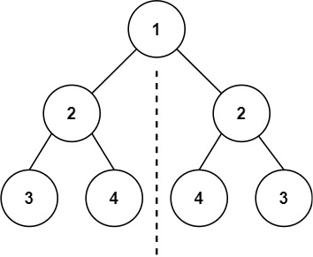
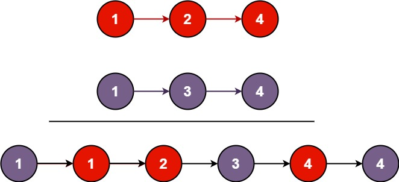

# leetcode101对称二叉树


!!! info "题目"
    给你一个二叉树的根节点 `root` ， 检查它是否轴对称。

    **示例 1:**
    
    > 输入：root = [1,2,2,3,4,4,3]
    > 输出：true

    **示例 2:**
    > 输入：root = [1,2,2,null,3,null,3]
    > 输出：false

这道题主要就是找到合理的递归条件，为此我们需要对问题进行略微的转化，或者说等价替换：
**判断一棵树是否对称**  ->  **如何判断树A和树B是否互为镜像？**
如此一来就简单了，A和B 镜像需要满足三个条件：
1.A和B的根节点的值相等
2.A的左子树和B的右子树镜像
3.A的右子树和B的左子树镜像
于是我们就可以轻易的写出代码：
```c
// 辅助函数，用来判断两棵树 t1 和 t2 是否互为镜像
bool isMirror(struct TreeNode* t1, struct TreeNode* t2) {
    // 基线条件1：如果两个都是空，那它们肯定是镜像。
    if (t1 == NULL && t2 == NULL) {
        return true;
    }

    // 基线条件2：如果一个空一个不空，那肯定不是镜像。
    if (t1 == NULL || t2 == NULL) {
        return false;
    }

    // 递归步骤：
    // 1. 两个根节点的值必须相等
    // 2. t1的左子树必须和t2的右子树互为镜像
    // 3. t1的右子树必须和t2的左子树互为镜像
    // 这三个条件必须同时成立！
    return (t1->val == t2->val)
        && isMirror(t1->left, t2->right)
        && isMirror(t1->right, t2->left);
}

// 主函数
bool isSymmetric(struct TreeNode* root) {
    // 如果树是空的，那它就是对称的
    if (root == NULL) {
        return true;
    }
    // 否则，判断它的左右子树是不是互为镜像
    return isMirror(root->left, root->right);
}
```
从这道题学到的知识主要是对问题进行等价替换来寻找可能存在的递归关系
